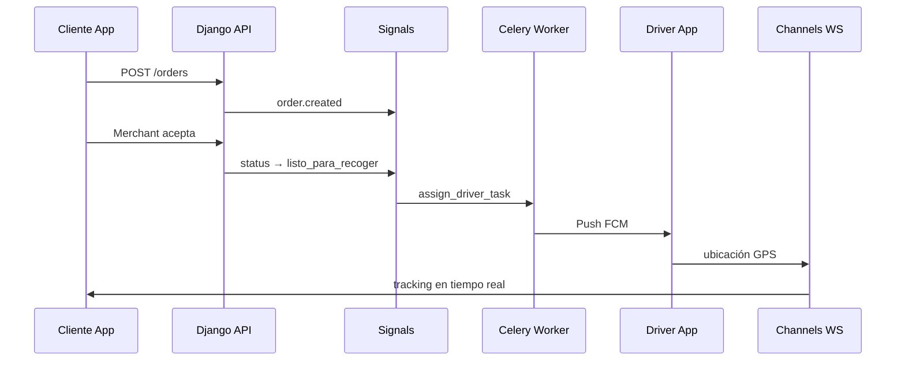

# Arquitectura del Proyecto

## Principios

1. **Vertical Slice**: cada feature es un módulo autocontenido.
2. **Clean Architecture**: dependencias apuntan hacia `domain`.
3. **Tests por tarea**: cada tarea en `docs/TASKS.md` define tests obligatorios.
4. **Django pragmático**: ORM y admin en `infrastructure`; reglas de negocio en `domain`.

## Monorepo

```
dts-app-ecommerce/
├── backend/                 # Django + DRF + Portales + Celery + Channels
├── flutter-customer/        # App móvil cliente
├── flutter-driver/          # App móvil conductor
├── docs/                    # Roadmap, tareas, arquitectura
└── .cursor/                 # Reglas, comandos y skills
```

## Backend (Django)

Cada módulo vive en `backend/features/<modulo>/` y se registra como Django app.

```
features/orders/
├── domain/
│   ├── entities.py          # Order, OrderItem (sin Django)
│   ├── value_objects.py     # OrderStatus, Money
│   ├── repositories.py      # OrderRepository (Protocol/ABC)
│   └── services.py          # OrderStateMachine
├── application/
│   ├── use_cases/
│   │   ├── create_order.py
│   │   └── transition_status.py
│   └── dto.py
├── infrastructure/
│   ├── models.py            # Django ORM
│   ├── repositories.py      # Implementación ORM
│   ├── serializers.py       # DRF
│   ├── views.py             # ViewSets / APIViews
│   ├── signals.py           # post_save, etc.
│   ├── tasks.py             # Celery
│   └── admin.py
└── tests/
    ├── domain/
    ├── application/
    └── infrastructure/
```

### Mapeo Django ↔ Clean Architecture

| Capa | Responsabilidad | Django |
|------|-----------------|--------|
| `domain` | Reglas puras, sin framework | Sin imports de Django |
| `application` | Casos de uso | Llama domain + repos |
| `infrastructure` | Persistencia, HTTP, tareas | Models, DRF, Celery, Templates |

### Catálogo: productos y servicios

El módulo `features/products/` soporta **dos tipos de ítem**:

- **PHYSICAL** — comida, artículos; control de stock
- **SERVICE** — limpieza, reparaciones; visita a domicilio, sin stock

Categorías con jerarquía de 2 niveles (raíz → subcategoría).  
Documento completo: [PRODUCTS_AND_SERVICES.md](PRODUCTS_AND_SERVICES.md)

Los pedidos de servicio (Fase 1.5, T1.5.8–1.5.10) usan un flujo de estados distinto al delivery con conductor.

### Portales web

Los portales viven en `backend/portals/`:

- `portals/merchant/` — CRUD productos, dashboard pedidos
- `portals/admin/` — métricas, comisiones, marketing

Cada portal consume los mismos use cases de `features/`.

## Flutter (Cliente y Conductor)

```
lib/
├── core/                    # Config, DI, errores, red compartida
└── features/<modulo>/
    ├── domain/
    │   ├── entities/
    │   ├── repositories/    # Interfaces abstractas
    │   └── usecases/
    ├── application/
    │   ├── providers/       # Riverpod / Bloc
    │   └── state/
    ├── infrastructure/
    │   ├── datasources/     # API, local storage
    │   ├── models/          # DTOs + mappers
    │   └── repositories/  # Implementaciones
    └── presentation/
        ├── screens/
        └── widgets/
```

### Regla de dependencias Flutter

```
presentation → application → domain ← infrastructure
```

`infrastructure` implementa interfaces de `domain`. `presentation` nunca importa `infrastructure` directamente (solo vía DI).

## Flujo de un pedido (referencia)



## Módulos por fase

| Fase | Backend | Flutter Customer | Flutter Driver |
|------|---------|------------------|----------------|
| 1 | accounts, stores, products, orders, delivery | — | — |
| 2 | notifications, analytics + Celery | — | — |
| 3 | portals (merchant, admin), marketing | — | — |
| 4 | — | auth, stores, catalog, cart, checkout, tracking | auth, availability, orders, navigation, location |
| 5 | channels (websockets) | tracking realtime | location streaming |
