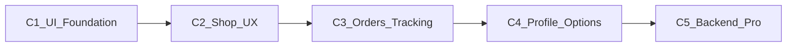

# Plan completo — App Cliente al 100%

**Proyecto:** `flutter-customer/`  
**Objetivo:** llevar el MVP de compra a app cliente profesional (nivel Rappi / Uber Eats), alineada visualmente con `flutter-driver`.

---

## Estado actual (honestidad)

El MVP de Fase 4–5 está **hecho** en lógica: auth (login/register/Google), tiendas, catálogo, carrito in-memory, checkout (físico + servicio), tracking mapa + WS, FCM + deep links.

Lo que falta es **producto**:

- Tema genérico `Colors.deepOrange` en `main.dart` — sin design system (el driver ya tiene Manrope + widgets DTS)
- Sin shell/tabs: home = lista cruda de tiendas
- Sin carrito editable, historial, perfil, settings, forgot password
- Checkout delivery **sin dirección de entrega**; chat es placeholder Dio en tracking
- Backend subutilizado: `GET /orders/`, banners, password-reset, detalle enriquecido, chat WS

**Enfoque:** equilibrado en 5 fases (UI base → compra → pedidos/tracking → perfil/opciones → APIs), **reutilizando el design system del driver** (verde tinta + ámbar, Manrope, widgets `Dts*`) con acento cliente.

---

## Fase 1 — Foundation UI (paridad con driver)

| Trabajo | Detalle |
|---------|---------|
| Design system | `lib/core/theme/app_theme.dart` + `lib/core/widgets/` (`DtsEmptyState`, `DtsErrorView`, `DtsLoading`, `DtsPrimaryButton`, `DtsStatusChip`, `DtsNetworkBanner`, `DtsSectionHeader`) |
| Tipografía | Bundlear Manrope en `assets/fonts/` (copiar de driver) |
| Auth | Rediseñar login/register (hero marca); link forgot password |
| Shell | `StatefulShellRoute` 3 tabs: **Inicio** / **Pedidos** / **Perfil** |
| Branding | Logo/splash mínimo; `ColorScheme` DTS (no deepOrange suelto) |
| Offline | `connectivity_plus` + banner global |

**Criterio:** ninguna pantalla crítica solo con `ListTile` + spinner sin empty/error/retry.

---

## Fase 2 — Experiencia de compra

### 2.1 Home pro
- Búsqueda de tiendas
- Chips categorías / tipo (productos vs servicios)
- Cards con logo, abierto/cerrado
- Banners desde `GET /marketing/banners/active/`
- Pull-to-refresh + empty states

### 2.2 Catálogo + carrito
- Sticky bar “Ver carrito (N) · $total”
- **CartScreen**: qty +/−, eliminar, vaciar, checkout
- Detalle producto/servicio con CTA claro

### 2.3 Checkout delivery con dirección
- Formulario dirección + notas + pin opcional (`geolocator`)
- Extender create order con `delivery_address` / lat/lng (backend Fase 5) o default local hasta entonces
- Resumen ítems + total

### 2.4 Tienda detalle
- Usar `GET /stores/{id}/`
- Bloquear checkout si cerrado

**Criterio:** buscar → tienda → carrito → checkout con dirección operable.

---

## Fase 3 — Pedidos, tracking y chat

### 3.1 Historial
- Tab Pedidos: `GET /orders/` con filtros
- Detalle `GET /orders/{id}/` enriquecido
- Seguir / reordenar / cancelar (`PATCH cancelled`)

### 3.2 Tracking pro
- Panel: estado, tienda, dirección, timeline
- Markers conductor + destino
- Botones Chat / Llamar

### 3.3 Chat en vivo
- Feature `chat/` limpia (sacar placeholder de tracking)
- REST + `WS /ws/orders/{id}/chat/`
- Ruta `/orders/:id/chat`

### 3.4 Push / deep links
- Cold start → tracking o detalle
- Local notification por estados relevantes

**Criterio:** post-pedido con historial, mapa vivo y chat sin hacks.

---

## Fase 4 — Perfil y opciones

| Pantalla | Contenido |
|----------|-----------|
| Perfil hub | Nombre, foto, menú |
| Editar perfil | API customer profile (Fase 5) |
| Direcciones | CRUD (API Fase 5); interim SharedPreferences |
| Settings | Notificaciones, ubicación, versión, **logout UI** |
| Ayuda / FAQ | Estático + soporte |
| Forgot password | `POST /accounts/password-reset/request/` |
| Apple Sign-In | Paridad iOS |

Rutas: `/profile`, `/profile/edit`, `/addresses`, `/settings`, `/help`, `/forgot-password`, `/orders`, `/cart`.

**Criterio:** ≥8 acciones útiles fuera de “hacer un pedido”.

---

## Fase 5 — Backend pro + docs

### APIs nuevas (prioridad)

| Endpoint | Propósito |
|----------|-----------|
| `GET/PATCH /accounts/customer/profile/` | Perfil cliente |
| CRUD `/accounts/customer/addresses/` | Multi-dirección lat/lng/label |
| Extender `POST /orders/` | `delivery_address`, coords, notes en delivery |
| Enrich `GET /orders/{id}/` | `driver_name` / `driver_phone` al customer |
| Opcional | `POST /marketing/coupons/validate/` + apply en create |

### Cierre
- Cablear Flutter a APIs reales
- Actualizar `FLUTTER_API.md`, `PROGRESS.md`, `ROADMAP.md`, `ESTADO_PROYECTO_CLIENTE.md`, `AGENTS.md`
- Tests widget + checklist E2E
- Dark theme opcional

**Criterio:** perfil/direcciones/checkout con datos reales en Railway.

---

## Sprints

| Sprint | Alcance | Días |
|--------|---------|------|
| S1 | Fase 1 UI + shell + auth | 3–4 |
| S2 | Fase 2 home + carrito + checkout | 4–5 |
| S3 | Fase 3 historial + tracking + chat | 4–5 |
| S4 | Fase 4 perfil/settings/forgot/Apple | 2–3 |
| S5 | Fase 5 backend + docs/tests | 3–4 |

**Total:** ~3–4 semanas.

---

## Fuera de alcance (v1)

- Pagos in-app / Stripe / QR
- Favoritos persistentes (v1.1)
- Reviews / rating
- Multi-idioma
- Wallet

---

## Definición de “100%”

1. Shell Inicio / Pedidos / Perfil con UI DTS
2. Home con búsqueda + banners; carrito editable; checkout con dirección
3. Historial + tracking pro + chat vivo
4. Perfil, direcciones, settings, logout, forgot password
5. Push/deep links + banner red
6. Docs y tests al día

---

## Archivos clave

- Flutter: `app_router.dart`, `main.dart`, stores/catalog/checkout/tracking, nuevo `core/theme`, `core/widgets`, features `orders/`, `profile/`, `cart` UI, `chat/`
- Backend: customer profile + addresses; order delivery address; driver info en detalle; opcional cupones
