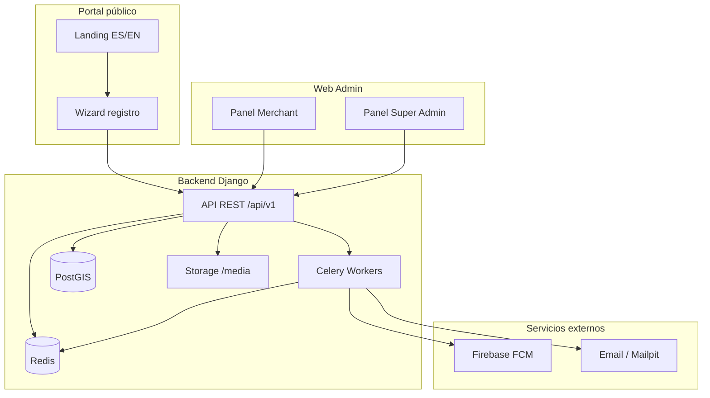

# Estado del Proyecto — DTS Delivery Platform

**Documento para cliente**  
**Fecha:** 8 de junio de 2026  
**Repositorio:** DTS-E-Commerce (monorepo)  
**Contacto técnico:** equipo de desarrollo DTS  

---

## 1. Resumen ejecutivo

DTS Delivery Platform es una plataforma de **comercio local, delivery y servicios a domicilio** compuesta por:

| Componente | Tecnología | Estado |
|------------|------------|--------|
| API Backend | Django + DRF + PostGIS + Celery | ✅ Operativo |
| Panel comercio (web) | Next.js + Tailwind | ✅ Operativo |
| Panel super admin (web) | Next.js + Tailwind | ✅ Operativo |
| Portal público / marketing | Next.js (ES + EN) | ✅ Operativo |
| App cliente (móvil) | Flutter | ✅ Pro (shell, carrito, pagos, tracking, Apple) |
| App conductor (móvil) | Flutter | ✅ Pro (KYC, proof, payouts, chat) |
| Tracking tiempo real (WebSocket) | Django Channels | ✅ Operativo |

### Avance global estimado

| Métrica | Valor | Notas |
|---------|-------|-------|
| **Tareas planificadas completadas** | **~165 / 189 (~87 %)** | Incluye post-MVP S0–S5 |
| **Visión producto completa (4 apps + realtime)** | **~85 %** | Apps móvil + WS operativos; falta hardening stores |
| **Plataforma web + API (operable hoy)** | **~100 %** | Un comercio puede registrarse, publicar catálogo y gestionar pedidos vía web |

**Conclusión para el cliente:** las **apps móvil cliente y conductor** están en nivel **piloto profesional** con pagos flexibles, horarios/zonas, KYC conductor y marketplace básico (reviews, favoritos). Falta despliegue Railway con migraciones nuevas y publicación en stores.

---

## 2. Avance por fase del roadmap

```
Fase 1 — Backend fundamentos          ████████████████████  100 %
Fase 2 — Celery + notificaciones      ████████████████████  100 %
Fase 3 — Web merchant + admin MVP     ████████████████████  100 %
Fase 6 — Onboarding y portal seller   ████████████████████  100 %
Extras — Landing i18n + mejoras UX    ████████████████████  100 %
Fase 4 — Apps Flutter                   ██████████████████░░   ~90 %
Fase 5 — Tiempo real (WebSocket)        ████████████████████  100 %
Post-MVP — Pagos, horarios, KYC         ████████████████████  100 %
```

| Fase | Descripción | Tareas | Estado |
|------|-------------|--------|--------|
| **1** | API REST, auth JWT, tiendas, productos, pedidos, GPS histórico | 39/39 | ✅ Completa |
| **2** | Celery, signals, asignación conductor, push FCM, email, reportes | 21/21 | ✅ Completa |
| **3** | Panel merchant y super admin (catálogo, pedidos, KPIs, cupones) | 23/23 | ✅ Completa |
| **6** | Registro público comercio, catálogo enriquecido, fotos, promociones | 68/68 | ✅ Completa |
| **4** | App Flutter cliente + app conductor | ~30/33 | ✅ ~90 % |
| **5** | WebSocket tracking en vivo | 9/9 | ✅ Completa |
| **Post-MVP** | Pagos, horarios/zonas, KYC, marketplace | — | ✅ Implementado (ver `POST_MVP_PROGRESS.md`) |

---

## 3. Qué está hecho e integrado (detalle funcional)

### 3.1 Backend API (`backend/`)

- **Autenticación:** registro por rol, login JWT (access + refresh), permisos por rol (`merchant`, `super_admin`, `driver`, `customer`).
- **Tiendas:** CRUD con ubicación PostGIS, perfil, horarios, logo, estado activo/suspendido.
- **Catálogo dual:** productos físicos (comida, retail) y **servicios a domicilio** con categorías y subcategorías.
- **Campos dinámicos por categoría:** configuración heredable (ej. tallas S/M/L/XL en “Ropa” → Camisas/Pantalones); el producto elige qué opciones ofrece (multi-select).
- **Pedidos:** máquina de estados delivery + flujo separado para pedidos de servicio.
- **Delivery:** registro histórico de ubicaciones GPS del conductor.
- **Async:** Celery workers, asignación automática de conductor, notificaciones push (FCM) y email.
- **Marketing admin:** cupones y banners vía API.
- **Analytics:** reportes nocturnos de ventas/comisiones.
- **Medios:** subida de fotos de producto y logos; servicio de archivos `/media/` en Docker.
- **Documentación API:** Swagger en `/api/v1/docs/`.
- **Despliegue:** stack 100 % Docker (PostGIS, Redis, API, Celery). Ver `docs/DEPLOY_DOCKER.md`.

### 3.2 Panel comercio — Web (`/merchant/*`)

| Módulo | Funcionalidad |
|--------|----------------|
| **Dashboard** | KPIs de ventas y ganancia neta por tienda |
| **Productos y servicios** | Crear/editar en pantallas dedicadas; fotos; campos dinámicos de categoría |
| **Categorías** | Árbol con modales; configuración de parámetros (tallas, colores, etc.) |
| **Inventario** | Stock solo productos físicos |
| **Pedidos delivery** | Lista, aceptar, preparar; actualización automática (polling) |
| **Pedidos servicio** | Dashboard específico servicios a domicilio |
| **Promociones** | Descuentos por tienda |
| **Configuración** | Perfil tienda, logo, datos de contacto |
| **Sesión** | Refresh token automático; persistencia de tienda activa (Zustand) |

### 3.3 Panel super admin — Web (`/admin/*`)

| Módulo | Funcionalidad |
|--------|----------------|
| **Dashboard** | KPIs globales, gráfico ventas 7 días, acciones rápidas |
| **Comercios** | Listado, filtros verificación, suspender/reactivar tiendas |
| **Comisiones** | Ventas por comercio; export CSV |
| **Cupones** | CRUD cupones plataforma |
| **Banners** | CRUD banners para app cliente (cuando exista) |
| **UI** | Shell profesional con navegación agrupada y cierre de sesión |

### 3.4 Portal público — Web

| Ruta | Funcionalidad |
|------|----------------|
| `/` → `/es` o `/en` | Landing marketing bilingüe (detección idioma navegador) |
| `/registro-comercio` | Wizard 3 pasos: cuenta → negocio → resumen |
| `/confirmar-email` | Verificación de correo merchant |
| `/login` | Acceso merchant y super admin |
| `/vender` | Redirección a sección comercios en landing |

### 3.5 Apps móvil Flutter

| App | Estado actual |
|-----|----------------|
| `flutter-customer/` | Solo proyecto base (placeholder); **sin flujos de negocio** |
| `flutter-driver/` | Solo proyecto base (placeholder); **sin flujos de negocio** |

---

## 4. Integraciones técnicas realizadas



| Integración | Estado |
|-------------|--------|
| PostgreSQL + PostGIS (geo) | ✅ |
| Redis (Celery + cache) | ✅ |
| JWT + refresh token (web) | ✅ |
| Celery + Beat | ✅ |
| Push FCM (backend preparado) | ✅ API; falta app móvil que registre token |
| Email transaccional | ✅ (Mailpit en dev; SMTP configurable) |
| Almacenamiento imágenes local | ✅ |
| S3 / Cloudinary (prod) | ✅ Abstracción lista; config por entorno |
| Docker Compose despliegue | ✅ |
| Tests backend (pytest) | ✅ |
| Tests E2E web (Playwright) | ✅ Flujos merchant, admin, onboarding, catálogo |

---

## 5. Mejoras recientes (fuera del plan original de tareas)

Estas entregas añaden valor pero no tienen ID de tarea en `TASKS.md`:

| Mejora | Descripción |
|--------|-------------|
| **Landing marketing i18n** | Sitio público ES/EN en `localhost:3000` explicando negocio, comercios y conductores |
| **Refresh JWT** | Sesión web estable al recargar página |
| **Campos dinámicos categoría** | Reemplazo de porciones/ingredientes fijos por parámetros configurables y heredables |
| **UI productos** | Pantallas separadas crear/editar; categorías con modales |
| **Panel admin rediseñado** | Navegación clara, KPIs, acciones rápidas |
| **Página licencias** | `/es/licenses` y `/en/licenses` |

---

## 6. Qué falta por desarrollar

### Fase 4 — Apps móvil (prioridad siguiente)

**App cliente (`flutter-customer`):**
- Login y registro cliente
- Listado de comercios y catálogo
- Carrito y checkout (delivery + servicio)
- Seguimiento de pedido
- Registro token FCM y notificaciones push
- Deep links desde push

**App conductor (`flutter-driver`):**
- Login conductor
- Disponibilidad en línea / fuera de línea
- Recibir, aceptar y completar entregas
- GPS en segundo plano
- Push de nuevos pedidos

**Estimado en plan:** 33 tareas · **0 % completado**

### Fase 5 — Tiempo real

- Django Channels + Redis channel layer
- WebSocket ubicación conductor → cliente
- Cliente Flutter escuchando WS en mapa
- Conductor emitiendo ubicación por WS
- Documentación alternativa Firebase

**Estimado en plan:** 9 tareas · **0 % completado**

---

## 7. Matriz de avance por módulo de negocio

| Área de negocio | Backend | Web | Móvil | Avance área |
|-----------------|---------|-----|-------|-------------|
| Registro y onboarding comercio | ✅ | ✅ | — | **100 %** |
| Catálogo (productos, servicios, categorías) | ✅ | ✅ | ⬜ | **67 %** |
| Pedidos delivery | ✅ | ✅ | ⬜ | **67 %** |
| Pedidos servicio a domicilio | ✅ | ✅ | ⬜ | **67 %** |
| Inventario y stock | ✅ | ✅ | — | **100 %** |
| Promociones tienda | ✅ | ✅ | ⬜ | **67 %** |
| Panel métricas merchant | ✅ | ✅ | — | **100 %** |
| Admin: comercios y moderación | ✅ | ✅ | — | **100 %** |
| Admin: finanzas y cupones | ✅ | ✅ | — | **100 %** |
| Admin: banners marketing | ✅ | ✅ | ⬜ | **67 %** |
| Asignación conductor (automática) | ✅ | — | ⬜ | **50 %** |
| Push notifications | ✅ | — | ⬜ | **33 %** |
| Tracking GPS en mapa (vivo) | ⬜ | — | ⬜ | **0 %** |
| App cliente (comprar) | — | — | ⬜ | **0 %** |
| App conductor (repartir) | — | — | ⬜ | **0 %** |
| Landing pública / marketing | — | ✅ | — | **100 %** |

---

## 8. Entornos y URLs de demostración

| Servicio | URL local | Notas |
|----------|-----------|-------|
| Web (landing + paneles) | http://localhost:3000 | `pnpm dev` en `web-admin/` |
| Landing ES | http://localhost:3000/es | |
| Landing EN | http://localhost:3000/en | |
| Login | http://localhost:3000/login | |
| Registro comercio | http://localhost:3000/registro-comercio | |
| Panel merchant | http://localhost:3000/merchant | Requiere rol merchant |
| Panel admin | http://localhost:3000/admin | Requiere super_admin |
| API | http://localhost:8000/api/v1/ | `make up` (Docker) |
| Swagger | http://localhost:8000/api/v1/docs/ | |
| Django Admin | http://localhost:8000/admin/ | |

**Despliegue servidor:** un comando `make up` levanta DB, API, workers, migraciones y static. Ver `docs/DEPLOY_DOCKER.md`.

---

## 9. Calidad y pruebas

| Tipo | Cobertura |
|------|-----------|
| Tests unitarios/integración backend | Módulos accounts, stores, products, orders, delivery, notifications |
| Tests E2E web-admin (Playwright) | Registro merchant, catálogo, pedidos, admin, promociones, fotos, landing |
| Tests Flutter | Placeholder únicamente (sin features) |

---

## 10. Próximos hitos recomendados

| Orden | Hito | Entregable para cliente |
|-------|------|-------------------------|
| **1** | Fase 4 — App cliente MVP | Cliente puede ver tiendas, armar carrito y pedir |
| **2** | Fase 4 — App conductor MVP | Conductor recibe y completa entregas |
| **3** | Fase 5 — Tracking en vivo | Mapa con conductor moviéndose en tiempo real |
| **4** | Publicación stores | App cliente en TestFlight / Play Internal Testing |

**Duración orientativa:** Fases 4 y 5 representan el **~20 % restante de tareas** pero el **~33 % del valor producto** (experiencia móvil end-to-end).

---

## 11. Glosario breve

| Término | Significado |
|---------|-------------|
| **Merchant / Comercio** | Negocio registrado que vende productos o servicios |
| **Super Admin** | Operador de la plataforma DTS |
| **Vertical** | Tipo de negocio: comida, retail, servicios |
| **field_config** | Parámetros definidos en categoría (tallas, colores…) |
| **dynamic_values** | Opciones que cada producto ofrece dentro de esos parámetros |
| **BFF** | Capa Next.js (`/api/merchant/…`) entre web y Django |

---

## 12. Aprobación y seguimiento

| Campo | Valor |
|-------|-------|
| Versión documento | 1.0 |
| Fuente de verdad tareas | `docs/PROGRESS.md` (151 completadas, 38 pendientes) |
| Roadmap completo | `docs/ROADMAP.md` |
| Onboarding comercio | `docs/MERCHANT_ONBOARDING.md` |

*Este documento refleja el estado del repositorio a la fecha indicada. Para una demo en vivo se recomienda: landing pública → registro comercio → panel merchant con producto y foto → panel admin con métricas y moderación.*
