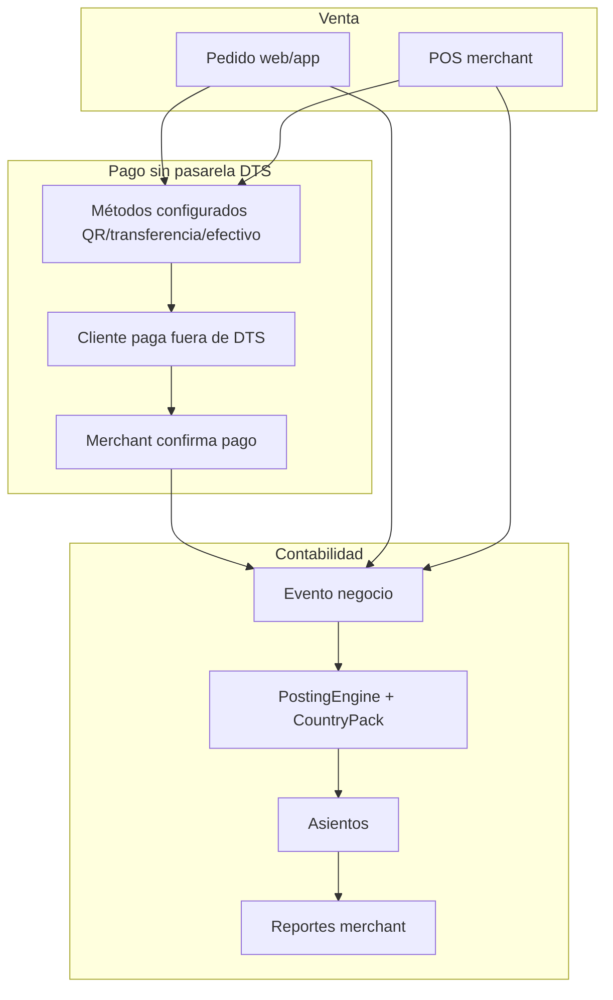

# Evolución — Finanzas, contabilidad y pagos flexibles (Fase 8)

**Estado:** Planificación · **No implementado aún**  
**Fecha:** Junio 2026  
**Relacionado:** [ROADMAP.md](ROADMAP.md) · [TASKS.md](TASKS.md) (Fase 8 futura) · [ADMIN_MATURITY.md](ADMIN_MATURITY.md)

---

## 1. Objetivo

Permitir que un comercio en DTS:

1. **Vea la contabilidad** de su actividad (ventas, comisiones, impuestos estimados, movimientos).
2. **Opcionalmente use un módulo de venta** (POS / caja) dentro del panel o en tablet.
3. **Cobre con su propio método de pago** (QR, transferencia, efectivo, link externo) **sin que DTS sea procesador de pagos**.

Todo debe ser **evolutivo**, **probable por partes** y **adaptable por país** (Venezuela, Colombia, Estados Unidos, etc.).

---

## 2. Principios de diseño (importante)

| Principio | Qué significa en la práctica |
|-----------|-------------------------------|
| **DTS no procesa pagos** | No guardamos tarjetas, no somos pasarela. Registramos *cómo* se pagó y *si* el merchant confirmó el cobro. |
| **Pagos = configuración + evidencia** | El comercio sube su QR (imagen/URL), datos Zelle/Pago Móvil/Nequi, etc. El cliente ve eso y paga **fuera** de DTS. |
| **Contabilidad = libro interno** | Generamos asientos desde eventos de negocio (pedido completado, comisión, devolución). No reemplazamos un ERP ni un contador certificado. |
| **País = plantilla** | Plan de cuentas, impuestos y formatos de reporte vienen de un **CountryPack** (VE, CO, US). El merchant puede ajustar cuentas hijas. |
| **Incremental** | Cada etapa entrega valor y tests. No esperar a tener “contabilidad perfecta” para lanzar la primera. |
| **Fuente de verdad = pedidos** | Hoy `Order.total`, promos y comisión plataforma ya existen. La contabilidad **deriva** de ahí, no duplica lógica de precios. |

---

## 3. Qué tienes hoy (punto de partida)

### Backend

| Módulo | Qué hace | Limitación |
|--------|----------|------------|
| `orders` | `Order.total`, `OrderItem`, estados completados | No hay `payment_method`, ni `paid_at`, ni factura |
| `stores` | Dashboard merchant: ventas, comisión %, neto | Solo agregación; no asientos contables |
| `analytics` | `DailySalesReport`, comisiones conductor, Celery nocturno | Admin plataforma; no libro mayor merchant |
| `accounts` | `MerchantProfile.tax_id` | Sin país, moneda ni régimen fiscal |
| `marketing` | Promos descuento | Afectan total pero no hay línea contable de descuento |

### Web-admin

| Pantalla | Qué hace |
|----------|----------|
| `/merchant` | KPIs ventas, comisión plataforma, neto |
| `/admin/commissions` | Reporte comisiones + export CSV |
| Pedidos | Flujo operativo; **sin cobro ni conciliación** |

### Lo que **no** existe

- Plan de cuentas (chart of accounts)
- Asientos contables (débito/crédito)
- Moneda por tienda/país
- Métodos de pago configurables
- QR / instrucciones de pago por comercio
- POS / venta mostrador
- Factura electrónica / DIAN / SENIAT / IRS
- Conciliación bancaria

**Conclusión:** ya tienes **datos de venta** suficientes para un **libro de ingresos simple**. Falta la capa contable y la capa “cómo pagar” desacoplada de pasarelas.

---

## 4. Visión por capas

```
┌─────────────────────────────────────────────────────────────┐
│  Capa 4 — Reportes contables merchant (PDF/Excel, por país) │
├─────────────────────────────────────────────────────────────┤
│  Capa 3 — Libro mayor + asientos automáticos (Ledger)       │
├─────────────────────────────────────────────────────────────┤
│  Capa 2 — Pagos flexibles (QR, transferencia, efectivo)     │
│           [sin procesador DTS]                              │
├─────────────────────────────────────────────────────────────┤
│  Capa 1 — Registro comercial (pedidos, POS opcional)        │
│           [YA EXISTE parcialmente]                          │
└─────────────────────────────────────────────────────────────┘
```

Cada capa se puede lanzar y probar **sin** las superiores completas.

---

## 5. Modelo conceptual

### 5.1 Eventos de negocio → asientos

Un **evento** dispara uno o más **asientos** según plantilla del país:

| Evento | Ejemplo asiento (simplificado) |
|--------|----------------------------------|
| Pedido completado (venta) | Débito: Cuentas por cobrar / Efectivo · Crédito: Ventas · Crédito: IVA por pagar |
| Comisión plataforma | Débito: Comisión plataforma · Crédito: Por pagar a plataforma |
| Descuento promoción | Débito: Descuentos ventas · Crédito: Ventas (ajuste) |
| Venta POS efectivo | Débito: Caja · Crédito: Ventas |
| Pago confirmado (manual) | Débito: Banco/Pago móvil · Crédito: Cuentas por cobrar |

Los asientos se generan en **backend** (`features/accounting/`) con Clean Architecture, igual que orders/products.

### 5.2 Plan de cuentas por país (CountryPack)

Estructura propuesta:

```
CountryPack (VE | CO | US)
├── currency_default (VES, COP, USD)
├── tax_profiles (IVA 16%, IVA 19%, Sales tax state-level…)
├── chart_template[]     # cuentas semilla
│   ├── code: "1105"
│   ├── name: "Caja"
│   ├── type: ASSET
│   └── parent: null
└── journal_templates[]  # reglas evento → líneas
```

El **merchant** recibe la plantilla al registrar la tienda (según país elegido) y puede:

- Activar/desactivar cuentas hijas
- Mapear “mi QR Pago Móvil” → cuenta `1110 Banco mercantil`
- **No** editar libremente códigos raíz del pack (evita romper reportes)

### 5.3 Pagos sin pasarela DTS

```
┌──────────────┐     muestra QR/datos      ┌──────────────┐
│ App cliente  │ ────────────────────────► │ Pantalla pago│
│ o POS web    │                           │ (solo UI)    │
└──────────────┘                           └──────┬───────┘
                                                  │
                     usuario paga en app banco     │
                     (Mercantil, Nequi, Zelle…)   ▼
                                           ┌──────────────┐
                                           │ Merchant     │
                                           │ confirma     │
                                           │ "Recibí pago"│
                                           └──────┬───────┘
                                                  │
                                                  ▼
                                           Order.payment_status = PAID
                                           → asiento contable
```

**PaymentMethodConfig** (por tienda):

| Campo | Ejemplo VE | Ejemplo CO | Ejemplo US |
|-------|------------|------------|------------|
| `type` | `QR_IMAGE`, `BANK_TRANSFER`, `CASH`, `EXTERNAL_LINK` | igual | igual |
| `label` | Pago Móvil Mercantil | Nequi / Bancolombia | Zelle / Venmo |
| `qr_image_url` | imagen PNG del QR | QR Nequi | QR estático opcional |
| `instructions` | Teléfono, cédula, banco | Cuenta ahorro | email Zelle |
| `is_active` | true | true | true |
| `sort_order` | 1 | 1 | 1 |

DTS **nunca** valida el movimiento bancario automáticamente en la fase inicial (salvo integraciones futuras opcionales por país).

---

## 6. Plan evolutivo — etapas probables

Cada etapa: **alcance**, **dónde probar**, **criterio de éxito**, **depende de**.

---

### Etapa 8.1 — Fundamentos tienda (país, moneda, perfil fiscal)

**Alcance**

- `Store.country_code` (ISO: VE, CO, US)
- `Store.currency` (VES, COP, USD)
- Extender `/merchant/settings`: país, moneda, NIT/RIF/EIN (reutilizar `tax_id`)
- Sembrar `CountryPack` al guardar país (solo metadata, sin asientos aún)

**Dónde probar**

1. Registrar comercio → elegir país en settings
2. Dashboard merchant muestra montos con símbolo correcto (`$`, `Bs.`, `$ COP`)
3. API devuelve `currency` en store profile

**Éxito**

- Merchant VE ve Bs.; merchant US ve USD
- Tests: domain validación moneda/país

**Depende de:** nada (Fase 6 ✅)

---

### Etapa 8.2 — Métodos de pago flexibles (QR e instrucciones)

**Alcance**

- Modelo `StorePaymentMethod` + CRUD API
- UI `/merchant/settings/payments`: subir QR, texto instrucciones, activar/desactivar
- Checkout web / detalle pedido cliente: pantalla “Cómo pagar” con métodos activos
- Pedido: `payment_method_id`, `payment_status` (`PENDING`, `PAID`, `FAILED`, `CASH_ON_DELIVERY`)
- Merchant marca “Confirmar pago recibido” en detalle pedido

**Dónde probar**

1. Merchant sube QR Pago Móvil (VE)
2. Cliente (web o mock) ve QR al confirmar pedido
3. Merchant confirma pago → estado `PAID`
4. E2E: flujo pendiente → confirmado

**Éxito**

- Cero integración con Stripe/MercadoPago API
- Al menos 2 métodos activos por tienda (ej. QR + efectivo)

**Depende de:** 8.1 (moneda para mostrar monto a pagar)

---

### Etapa 8.3 — Libro de ingresos simple (pre-contabilidad)

**Alcance**

- No asientos doble partida aún: **Registro de movimientos** (`FinancialMovement`)
  - `date`, `type` (SALE, COMMISSION, REFUND, ADJUSTMENT)
  - `amount`, `currency`, `order_id`, `description`
- Generación automática al completar pedido y al confirmar pago
- UI `/merchant/finance/movements` — tabla filtrable por fecha
- Export CSV (reutilizar patrón `/admin/commissions`)

**Dónde probar**

1. Completar 3 pedidos → 3 movimientos SALE
2. Confirmar pago → movimiento conciliado
3. Dashboard neto = suma movimientos − comisión (debe cuadrar con KPI actual)

**Éxito**

- Merchant descarga CSV mensual de ingresos
- Tests: agregación cuadra con `MerchantDashboardAggregator`

**Depende de:** 8.2 (payment_status), pedidos existentes

---

### Etapa 8.4 — Plan de cuentas + asientos automáticos

**Alcance**

- Módulo `features/accounting/`:
  - `Account`, `JournalEntry`, `JournalLine`
  - `ChartOfAccountsTemplate` por CountryPack
  - `PostOrderCompletedUseCase` → genera asiento balanceado
- UI `/merchant/finance/chart` — árbol cuentas (solo lectura + activar hijas)
- UI `/merchant/finance/journal` — listado asientos

**Plantillas iniciales (mínimo viable)**

| Código | Nombre | Tipo | VE | CO | US |
|--------|--------|------|----|----|-----|
| 1105 | Caja / Efectivo | Activo | ✓ | ✓ | ✓ |
| 1110 | Banco / Pago móvil | Activo | ✓ | ✓ | ✓ |
| 1305 | Cuentas por cobrar | Activo | ✓ | ✓ | ✓ |
| 4135 | Ventas | Ingreso | ✓ | ✓ | ✓ |
| 4210 | Comisión plataforma | Gasto | ✓ | ✓ | ✓ |
| 2408 | IVA / impuesto por pagar | Pasivo | ✓ (16%) | ✓ (19%) | configurable |

**Dónde probar**

1. Pedido $100 completado → asiento cuadra (débitos = créditos)
2. Con promoción 10% → línea descuento
3. Reporte “Balance de prueba” simplificado por merchant

**Éxito**

- Ningún asiento desbalanceado (invariante domain)
- Merchant entiende “de dónde salió el neto”

**Depende de:** 8.3 (movimientos migran a asientos o conviven un release)

---

### Etapa 8.5 — Reportes contables merchant

**Alcance**

- `GetMerchantIncomeStatementUseCase` — Estado de resultados periodo
- `GetMerchantTrialBalanceUseCase` — Balance de comprobación
- Export PDF/Excel por periodo
- Etiquetas y formatos según `CountryPack` (nombre impuesto, separador miles)

**Dónde probar**

1. Merchant pide reporte enero–marzo
2. Contador externo valida estructura (no certificación legal aún)
3. Comparar totales con dashboard KPI

**Éxito**

- Comercio puede entregar CSV/PDF a su contador
- Documento aclara: “reporte gerencial, no sustituto fiscal”

**Depende de:** 8.4

---

### Etapa 8.6 — Módulo POS opcional (venta mostrador)

**Alcance**

- Feature flag `store.pos_enabled`
- UI `/merchant/pos` — carrito rápido, buscar producto, cobrar
- Crear `Order` origen `POS` (nuevo campo `source`: APP, WEB, POS)
- Pago inmediato: efectivo / QR mostrado en pantalla
- Impresión ticket simple (browser print)

**Dónde probar**

1. Tablet merchant → vender 2 productos → efectivo
2. Asiento contable Caja ↔ Ventas al instante
3. Inventario descuenta stock (reutilizar StockValidator)

**Éxito**

- Tienda retail puede operar sin app cliente
- Mismo libro contable que pedidos delivery

**Depende de:** 8.2, 8.4 (ideal 8.3)

---

### Etapa 8.7 — Integraciones opcionales por país (futuro)

Solo cuando el merchant **opt-in** y el país lo permita:

| País | Integración opcional | Qué haría DTS |
|------|----------------------|---------------|
| CO | Link Wompi/PayU (redirect) | Webhook confirma pago → `PAID` automático |
| US | Stripe Connect (merchant conecta su cuenta) | DTS no toca fondos; split comisión |
| VE | Validación manual + referencia bancaria | Campo `payment_reference` obligatorio |
| Latam | Mercado Pago QR dinámico | Merchant OAuth; QR por monto |

**Principio:** cada integración es un **adapter** (`PaymentConfirmationProvider`). El core sigue funcionando solo con QR estático.

---

## 7. Cómo encaja con el roadmap actual

```
Fase 7 (madurez admin)     ← E2E, horarios, export Excel ventas (T7.5.6)
        ↓
Fase 8.1–8.3               ← país + pagos QR + libro ingresos  [PRIMER VALOR FINANCIERO]
        ↓
Fase 4 Flutter             ← checkout muestra QR del merchant
        ↓
Fase 8.4–8.5               ← contabilidad formal + reportes
        ↓
Fase 8.6 POS               ← módulo venta opcional
        ↓
Fase 8.7                   ← pasarelas opcionales por país
```

**Recomendación:** no esperar Flutter para iniciar **8.1–8.3** en web-admin. El merchant puede configurar pagos y ver ingresos antes de que exista app cliente.

---

## 8. Estructura técnica propuesta (backend)

```
features/
├── accounting/
│   ├── domain/
│   │   ├── entities.py          # Account, JournalEntry, JournalLine
│   │   ├── value_objects.py     # AccountType, CountryCode, Money
│   │   ├── services.py          # BalanceValidator, PostingEngine
│   │   └── country_packs/       # ve.py, co.py, us.py
│   ├── application/
│   │   ├── post_order_sale.py
│   │   ├── get_trial_balance.py
│   │   └── seed_chart_of_accounts.py
│   └── infrastructure/
│       ├── models.py
│       └── api/
├── payments/                    # capa "display + status", NO pasarela
│   ├── domain/
│   │   └── entities.py          # PaymentMethodConfig, PaymentStatus
│   ├── application/
│   │   ├── confirm_payment.py
│   │   └── list_payment_methods.py
│   └── infrastructure/
└── pos/                         # etapa 8.6
    └── application/
        └── create_pos_sale.py
```

**Señal Django:** al pasar pedido a `DELIVERED` / `COMPLETED` → `post_save` o use case explícito llama a `PostOrderSaleUseCase`.

---

## 9. Estructura técnica propuesta (web-admin)

```
features/
├── finance/
│   ├── components/
│   │   ├── MovementsTable.tsx
│   │   ├── JournalEntriesTable.tsx
│   │   └── IncomeStatementReport.tsx
│   └── stores/finance-store.ts
├── payments/
│   ├── components/
│   │   ├── PaymentMethodsForm.tsx    # QR upload, instrucciones
│   │   └── CustomerPaymentScreen.tsx # checkout "cómo pagar"
│   └── stores/payments-store.ts
└── pos/
    └── app/merchant/pos/page.tsx
```

Rutas merchant sugeridas:

| Ruta | Etapa |
|------|-------|
| `/merchant/settings/payments` | 8.2 |
| `/merchant/finance` | 8.3 (redirect movements) |
| `/merchant/finance/journal` | 8.4 |
| `/merchant/finance/reports` | 8.5 |
| `/merchant/pos` | 8.6 |

---

## 10. Country packs — detalle inicial

### Venezuela (VE)

- Moneda: **VES** (multi-moneda display opcional USD paralelo — solo UI, no FX automático fase 1)
- Impuesto: IVA 16% (cuenta 2408)
- Pagos típicos: Pago Móvil, transferencia, Zelle (USD), efectivo, Binance Pay (link/instrucciones)
- QR: imagen estática generada por el banco del merchant

### Colombia (CO)

- Moneda: **COP**
- Impuesto: IVA 19% / exentos por categoría (fase 2: exenciones por producto)
- Pagos: Nequi, Daviplata, Bancolombia, efectivo, link Wompi (8.7)
- Reporte: ventas brutas + IVA desglosado para contador

### Estados Unidos (US)

- Moneda: **USD**
- Impuesto: **sales tax** por estado (fase 1: tasa fija configurable por tienda; fase 2: por condado)
- Pagos: Zelle, Venmo, Cash App, tarjeta vía Stripe Connect (8.7), efectivo
- Legal: reporte gerencial; 1099-K etc. fuera de alcance inicial

---

## 11. Qué NO haremos (alcance explícito)

- Ser banco o money transmitter
- Custodiar fondos de terceros
- Facturación electrónica legal (DIAN, SENIAT, AFIP) en v1
- Conciliación bancaria automática sin API del banco
- Reemplazar QuickBooks / Siigo / Contabilium (export compatible sí, integración nativa después)
- Tipo de cambio oficial BCV en tiempo real (mostrar monto en moneda pedido basta)

Incluir disclaimer en UI: *“Reportes gerenciales. Consulte a su contador para obligaciones fiscales.”*

---

## 12. Matriz de pruebas por etapa

| Etapa | Backend tests | Web E2E | Prueba manual |
|-------|---------------|---------|---------------|
| 8.1 | país/moneda validation | settings guarda país | dashboard formato moneda |
| 8.2 | confirm payment API | flujo QR + confirmar | escanear QR real en celular |
| 8.3 | movements = order totals | export CSV | comparar con Excel |
| 8.4 | journal balanced | listado asientos | contador revisa estructura |
| 8.5 | income statement math | descargar PDF | periodo mes completo |
| 8.6 | POS order + stock | venta POS E2E | tablet en mostrador |
| 8.7 | webhook adapter mock | redirect pago CO | sandbox Wompi/Stripe |

---

## 13. IDs de tarea propuestos (Fase 8 — borrador)

Para cuando formalices en `TASKS.md`:

| Bloque | IDs | Tema |
|--------|-----|------|
| 8.1 | T8.1.1–T8.1.5 | País, moneda, perfil fiscal |
| 8.2 | T8.2.1–T8.2.8 | PaymentMethodConfig + confirmación |
| 8.3 | T8.3.1–T8.3.6 | FinancialMovement + export |
| 8.4 | T8.4.1–T8.4.10 | Accounting ledger + country packs |
| 8.5 | T8.5.1–T8.5.6 | Reportes PDF/Excel |
| 8.6 | T8.6.1–T8.6.8 | POS module |
| 8.7 | T8.7.1–T8.7.5 | Adapters pasarela opcional |

---

## 14. Primer sprint recomendado (2–3 semanas)

Si quieres **probar valor rápido** sin contabilidad completa:

1. **T8.1.1–T8.1.3** — país + moneda en Store y settings
2. **T8.2.1–T8.2.5** — subir QR + instrucciones + confirmar pago en pedido
3. **T8.3.1–T8.3.4** — tabla movimientos + CSV

**Demo al comercio:**

> “Configura tu QR de Pago Móvil → el cliente ve cómo pagarte → tú confirmas el cobro → ves tu libro de ventas del mes en CSV.”

Eso **no requiere** Flutter ni pasarela. Después encima construyes asientos (8.4) y POS (8.6).

---

## 15. Diagrama flujo completo (objetivo final)



---

## 16. Referencias internas

| Concepto actual | Archivo |
|-----------------|---------|
| Total pedido | `backend/features/orders/infrastructure/models.py` |
| Comisión plataforma | `backend/features/stores/domain/dashboard_services.py` |
| KPI neto merchant | `GetMerchantDashboardUseCase` |
| Export CSV admin | `web-admin/features/commissions/` |
| tax_id merchant | `MerchantProfile.tax_id` |
| Promos descuento | `StorePromotionDiscountCalculator` |

---

## 17. Siguiente paso documentación

Cuando decidas implementar:

1. Formalizar Fase 8 en `docs/TASKS.md` y `docs/PROGRESS.md`
2. Crear `docs/FASE8_BLOCKS.md` (como Fase 6/7)
3. Comando Cursor `/fase-8` y `/bloque-8-1`
4. Empezar por **8.1 + 8.2** (máximo valor, mínimo riesgo legal)

---

*Documento de planificación. No implica compromiso fiscal ni licencia financiera. Revisar regulación local antes de integrar pasarelas en producción.*
