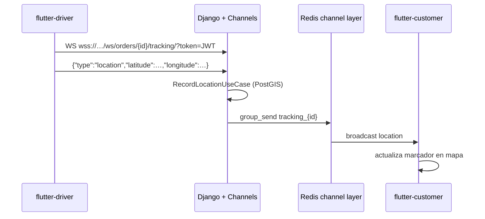
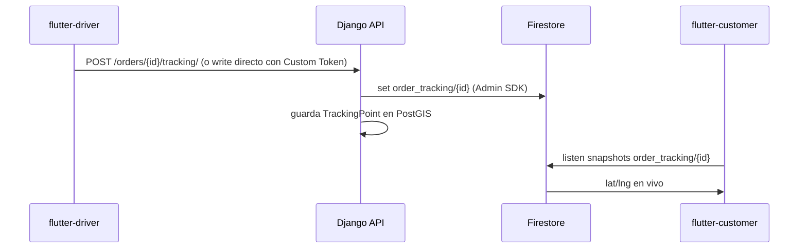

# Alternativa Firebase — Tracking en tiempo real

Documento de diseño (T5.5.1). **No está implementado**: la solución activa es Django Channels + Redis.

Referencias:

- Implementación actual: [FLUTTER_API.md](FLUTTER_API.md) (sección Tracking)
- Push FCM (evento, no GPS): [PUSH_NOTIFICATIONS.md](PUSH_NOTIFICATIONS.md)
- Arquitectura: [ARCHITECTURE.md](ARCHITECTURE.md)

---

## Qué hace hoy DTS (canónico)



| Pieza | Detalle |
|-------|---------|
| Ruta WS | `wss://{host}/ws/orders/{id}/tracking/?token={jwt}` |
| Auth | JWT SimpleJWT (`?token=` o `Authorization: Bearer`) |
| Room | `tracking_{order_id}` |
| Persistencia | `DeliveryTracking` / `TrackingPoint` (PostGIS) |
| Fallback | Cliente: polling REST 8s; Conductor: POST `/orders/{id}/tracking/` |

Latencia objetivo: **&lt; 2 s** conductor → cliente.

---

## Cuándo considerar Firebase

Usar Firestore (o Realtime Database) **solo** si:

1. Railway / ASGI no puede exponer WebSockets de forma estable (proxies, sticky sessions, límites de Daphne).
2. Se necesita escalar fan-out de ubicación sin operar Redis channel layer.
3. El equipo prioriza SDK móvil Firebase frente a mantener Channels.
4. Se quiere un **fallback de producto** mientras se estabiliza WS en staging/prod.

**No** sustituye push FCM: push = evento (`ON_THE_WAY`); tracking = stream de coordenadas.

---

## Propuesta Firestore (alternativa)

### Modelo de documento

Colección: `order_tracking/{orderId}`

```json
{
  "order_id": 42,
  "driver_id": 17,
  "customer_id": 9,
  "latitude": 4.7110,
  "longitude": -74.0721,
  "sequence": 12,
  "recorded_at": "2026-07-12T21:00:00Z",
  "updated_at": "2026-07-12T21:00:00Z"
}
```

Opcional — historial: subcolección `order_tracking/{orderId}/points/{autoId}` con los mismos campos geo + `sequence`.

### Flujo



Dos modos de escritura:

| Modo | Pros | Contras |
|------|------|---------|
| **A — Solo backend escribe** (recomendado) | Misma authz que REST; PostGIS sigue siendo fuente de verdad | Un hop extra (API → Firestore) |
| **B — Conductor escribe directo** | Menos latencia | Hay que emitir Custom Tokens Firebase y replicar reglas de “solo driver del pedido” |

### Security Rules (esqueleto — modo A)

```javascript
rules_version = '2';
service cloud.firestore {
  match /databases/{database}/documents {
    match /order_tracking/{orderId} {
      // Lectura: apps con Firebase Auth vinculada al mismo usuario DTS
      // (mapear uid ↔ CustomUser vía Custom Claims: role, user_id, order_ids).
      allow read: if request.auth != null
        && (
          request.auth.token.user_id == resource.data.customer_id
          || request.auth.token.user_id == resource.data.driver_id
        );
      // Escritura solo desde Admin SDK (backend) — denegar clientes.
      allow write: if false;
    }
  }
}
```

### Snippets Flutter (ilustrativos)

**Conductor** — sin cambio de dominio: sigue llamando `SendLocationUseCase`; el backend (o un adapter) publica en Firestore además del WS.

**Cliente** — datasource alternativo:

```dart
// Escucha documento order_tracking/{orderId}
FirebaseFirestore.instance
  .collection('order_tracking')
  .doc('$orderId')
  .snapshots()
  .map((snap) {
    final d = snap.data()!;
    return TrackingLocationUpdate(
      orderId: orderId,
      latitude: (d['latitude'] as num).toDouble(),
      longitude: (d['longitude'] as num).toDouble(),
      sequence: d['sequence'] as int?,
      recordedAt: (d['recorded_at'] as Timestamp?)?.toDate(),
    );
  });
```

---

## Comparación Channels vs Firebase

| Criterio | Django Channels (actual) | Firestore |
|----------|--------------------------|-----------|
| Infra | Redis + Daphne/ASGI | Proyecto Firebase ya usado (FCM / Auth) |
| Auth | JWT propio DTS | Custom Token o claims sincronizados |
| Persistencia GPS | PostGIS nativo | Hay que duplicar o sincronizar |
| Costo | Redis Railway | Lecturas/escrituras Firestore |
| Offline cliente | No (salvo polling REST) | SDK con caché local |
| Complejidad ops | Channel layer + WS en reverse proxy | Rules + tokens + sync Admin SDK |
| Latencia típica | Sub-segundo en misma región | Similar; depende de región Firebase |

**Recomendación:** mantener **Channels** como path principal. Firestore solo como plan B operativo o experimento A/B, nunca como segunda fuente de verdad sin sincronizar PostGIS.

---

## Plan de adopción (si se activa)

1. Habilitar Firestore en el mismo proyecto Firebase que FCM (`discorp-4a37b` u otro acordado).
2. Backend: tras `RecordLocationUseCase`, publicar documento con `firebase_admin` (mismo `FCM_CREDENTIALS_PATH` / service account).
3. Feature flag `TRACKING_TRANSPORT=channels|firestore|both` en settings.
4. `flutter-customer`: elegir datasource según flag (WS vs Firestore snapshots).
5. `flutter-driver`: sin cambios si el write lo hace el backend (modo A).
6. Prueba latencia &lt; 2 s en dispositivo real (Xiaomi + iOS).
7. Retirar flag `both` cuando un path sea estable.

---

## Qué no hacer

- No usar Firestore como único store de pedidos (órdenes siguen en Postgres).
- No mezclar RTDB y Firestore para el mismo stream sin motivo.
- No exponer service account en apps móviles.
- No sustituir push FCM por listeners de tracking (roles distintos).

---

## Estado

| Ítem | Estado |
|------|--------|
| Channels + WS (T5.1–T5.4) | ✅ Implementado |
| Doc alternativa Firebase (T5.5.1) | ✅ Este documento |
| Código Firestore tracking | ❌ No planificado en roadmap actual |
