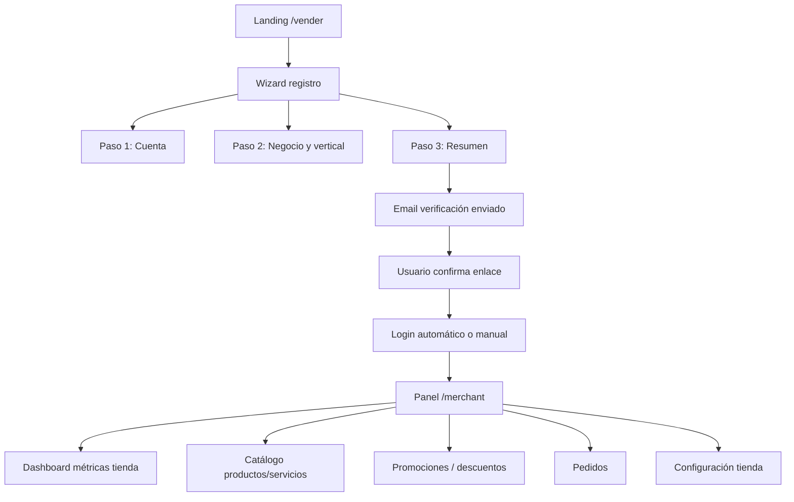

# Onboarding Comercio — Flujo vendedor (Seller)

Documento maestro del recorrido **“Quiero vender en DTS”**: registro público, verificación de email, configuración de tienda, catálogo enriquecido y panel operativo del merchant.

**Relacionado:** [TASKS.md](TASKS.md) Fase 6 · [PRODUCTS_AND_SERVICES.md](PRODUCTS_AND_SERVICES.md) · [WEB_ADMIN.md](WEB_ADMIN.md)

---

## Visión del producto

Un emprendedor llega a una **landing pública** (`/vender`), completa un wizard de registro, confirma su correo y accede al panel merchant para montar su tienda según su vertical:

| Vertical | Ejemplos | Tipo catálogo |
|----------|----------|---------------|
| **Comida** | Restaurante, comida rápida, repostería | `PHYSICAL` + variantes porción (S/M/L/XL), ingredientes, fotos |
| **Servicios** | Limpieza, plomería, belleza a domicilio | `SERVICE` + duración, descripción, fotos |
| **Productos hogar** | Ferretería, miscelánea, retail | `PHYSICAL` + stock, fotos |

Categorías **padre e hijas** (2 niveles) por tienda — ya modeladas en backend (T1.4); el onboarding **pre-selecciona plantillas** según vertical.

---

## Flujo end-to-end (usuario)



---

## Datos del formulario de registro (v1)

### Paso 1 — Cuenta

| Campo | Obligatorio | Notas |
|-------|-------------|-------|
| Nombre completo | Sí | `first_name` + `last_name` o campo único display |
| Email | Sí | Único; dispara verificación |
| Contraseña | Sí | Mín. 8 caracteres |
| Confirmar contraseña | Sí | Solo UI |

### Paso 2 — Negocio

| Campo | Obligatorio | Notas |
|-------|-------------|-------|
| Nombre de la empresa / tienda | Sí | `Store.name` + `MerchantProfile.business_name` |
| Vertical | Sí | `FOOD` \| `SERVICES` \| `RETAIL` |
| Categoría principal sugerida | Sí | Plantilla: Comida rápida, Servicios del hogar, Productos hogar, etc. |
| Teléfono contacto | Recomendado | `MerchantProfile.phone` |
| Ciudad / dirección base | Opcional v1 | Texto; geocoding en tarea posterior |

### Paso 3 — Confirmación

- Resumen de datos
- Aceptación términos (checkbox)
- Submit → API atómica: `User` + `MerchantProfile` + `Store` + categorías semilla + token email

---

## Verificación de email

1. Tras registro: `is_active=False` o flag `email_verified=False` hasta confirmar
2. Celery envía email con enlace: `{WEB_URL}/confirmar-email?token={uuid}`
3. `POST /api/v1/accounts/verify-email/` valida token (expira 24h)
4. Usuario puede iniciar sesión y acceder a `/merchant`

Reutiliza infra de email Fase 2 (`T2.4.7`); plantilla nueva `merchant_welcome`.

---

## Catálogo enriquecido (post-onboarding)

### Comida (`FOOD`)

- **Ingredientes:** lista editable (texto o entidad `ProductIngredient`)
- **Variantes / porciones:** S, M, L, XL con precio o delta (`ProductVariant`)
- **Fotos:** upload multipart; **v1** guardar en `MEDIA_ROOT`/session; **v2** S3/Cloudinary (T6.8)
- **Categorías:** árbol 2 niveles asignable en formulario producto

### Servicios (`SERVICES`)

- Duración estimada, descripción “qué incluye”, fotos
- Sin stock

### Retail (`RETAIL`)

- Stock, SKU opcional, fotos

---

## Métricas merchant (dashboard real)

Reemplazar placeholder `/merchant` con KPIs por tienda:

| KPI | Fuente |
|-----|--------|
| Ventas período | `DailySalesReport` / pedidos `DELIVERED` |
| Pedidos hoy / semana | `Order` filtrado por `store_id` |
| Ticket promedio | Calculado |
| Ganancia neta estimada | Ventas − comisión plataforma (config %) |
| Productos activos | Count `Product.is_active` |

API: `GET /api/v1/stores/{id}/merchant-dashboard/`

---

## Promociones (merchant)

Descuentos **por tienda** (distinto de cupones globales admin T3.5):

- Porcentaje o monto fijo
- Vigencia
- Aplica a producto específico o toda la tienda
- Merchant CRUD en `/merchant/promotions`

---

## Qué ya existe vs qué falta

| Capacidad | Estado actual (Fase 3) | Fase 6 |
|-----------|------------------------|--------|
| Registro merchant API básico | ✅ `POST /accounts/register/` | Wizard público + store atómico |
| Verificación email | ❌ | T6.1.x |
| Landing /vender | ❌ | T6.2.x |
| CRUD producto completo | ⚠️ solo crear + desactivar | Editar + fotos + variantes |
| Ingredientes / porciones | ❌ | T6.3–6.4 |
| Dashboard merchant KPIs | ❌ placeholder | T6.5 |
| Descuentos merchant | ❌ | T6.6 |
| Config tienda (logo, horarios) | ❌ | T6.7 |

---

## Orden de ejecución recomendado

```
Fase 1–2 (hecho) → Fase 3 MVP (hecho) → Fase 6 (este doc) → Fase 4 Flutter → Fase 5 Realtime
```

Comando: `/fase-6` o `/bloque-6-1` … `/bloque-6-10` · Tests: `make fase6-test BLOCK=6.1` — ver [FASE6_BLOCKS.md](FASE6_BLOCKS.md)

---

## Criterios de aceptación Fase 6

1. Un usuario nuevo completa registro en `/vender` sin intervención admin
2. Recibe email y confirma cuenta
3. Entra al panel, ve métricas de su tienda (aunque sean cero)
4. Crea producto comida con porciones e ingredientes y al menos una foto
5. Crea promoción de descuento para su tienda
6. Tests E2E y unitarios listados en TASKS.md en verde
