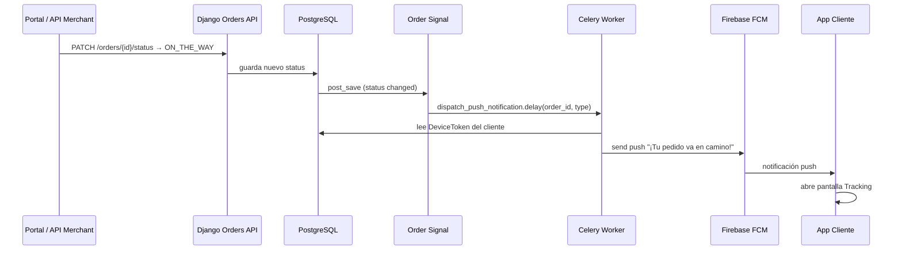

# Push Notifications — Plan de integración

**¿Puedes integrarlo ahora?** Sí, pero **en el orden correcto** del roadmap. No hace falta esperar al 100%, pero sí completar los prerequisitos de cada tarea.

## Cuándo implementar qué

```
Fase 1 (ahora)     → T1.2.8 DeviceToken + API registrar token FCM
Fase 1 (orders)    → T1.5.x OrderStatus (disparadores de push)
Fase 2             → T2.4.x Backend: Signals + Celery + FCM
Fase 4             → T4.1.5, T4.5.3–4.5.5 Cliente recibe push
Fase 4             → T4.8.2 Conductor recibe alerta nuevo pedido
```

**No rompe nada** si sigues con `T1.3.4` ahora. Las push se conectan cuando existan `Order`, `DeviceToken` y Celery (Fase 2).

---

## Flujo: comercio marca "ya salió el pedido"

Ejemplo: merchant cambia estado → `ON_THE_WAY` (o `PICKED_UP` según flujo).



---

## Mapa OrderStatus → Push

| Cambio de estado | Quién lo dispara | Destinatario | Mensaje push (ejemplo) |
|------------------|------------------|--------------|------------------------|
| `ACCEPTED_BY_MERCHANT` | Comercio | Cliente | "Tu pedido fue aceptado" |
| `IN_PREPARATION` | Comercio | Cliente | "Estamos preparando tu pedido" |
| `READY_FOR_PICKUP` | Comercio | Conductores online cuya **zona de trabajo** cubre la tienda | "Nuevo pedido listo para recoger" |
| `SEARCHING_DRIVER` | Comercio («Buscar conductor») / AssignDriver sync | Conductores online en zona | Misma plantilla (reintento / path manual) |
| `DRIVER_ASSIGNED` | Sistema (Celery) | Cliente | "Conductor asignado a tu pedido" |
| `PICKED_UP` | Conductor | Cliente | "El conductor recogió tu pedido" |
| `ON_THE_WAY` | Conductor / Comercio | Cliente | "¡Tu pedido ya salió! Va en camino" |
| `DELIVERED` | Conductor | Cliente | "Pedido entregado. ¡Buen provecho!" |
| `CANCELLED` | Comercio / Sistema | Cliente | "Tu pedido fue cancelado" |
| Chat (`type=chat_message`) | Cliente, conductor o **comercio** | Los **otros** participantes del pedido | Preview del mensaje → abre `/orders/{id}/chat` |

> Ofertas listadas al conductor y push `READY_FOR_PICKUP` usan la **zona de trabajo** del conductor (`work_center_*` + `work_radius_km`, presets 1–500 km; default 5). Si no hay centro configurado, fallback = GPS (`last_*`) + radio default 5 km. Si no hay drivers en zona, no se spamea; el Beat de auto-assign sigue como red de seguridad.
>
> El radio de descubrimiento de tiendas del cliente (`search_center_*` + `search_radius_km` en `GET /stores/?latitude=&longitude=&radius_km=`) es independiente y no afecta push de ofertas.

> Firebase apps: customer y driver usan el proyecto **dtsdrop**. En Railway, `FIREBASE_CUSTOMER_*` y `FIREBASE_DRIVER_*` deben apuntar a las service accounts correctas (no al proyecto legacy `discorp` si ya migraste).

---

## Tareas del plan (IDs)

### Fase 1 — Fundamento (token FCM)

| ID | Tarea |
|----|-------|
| T1.2.8 | `DeviceToken` model + API `POST /accounts/device-token/` |

> Hacer **antes de Fase 2** bloque 2.4. Puede hacerse después de terminar bloque 1.3–1.5.

### Fase 2 — Backend push (Celery + FCM)

| ID | Tarea |
|----|-------|
| T2.4.1 | `NotificationType` enum + plantillas de mensaje |
| T2.4.2 | Cliente FCM (`firebase-admin`) con mock en tests |
| T2.4.3 | `SendPushUseCase` + task Celery `send_push_task` |
| T2.4.4 | `OrderStatusNotificationMapper` (status → tipo → destinatario) |
| T2.4.5 | Signal genérico: cambio status → encola push |
| T2.4.6 | Caso `ON_THE_WAY`: push "pedido en camino" al cliente |
| T2.4.7 | Email transaccional (Mailpit en dev) |

| ID | Tarea (signals específicos) |
|----|-------|
| T2.2.4 | Signal `READY_FOR_PICKUP` → push a conductores |
| T2.2.5 | Signal `ACCEPTED_BY_MERCHANT` → push al cliente |

### Fase 4 — Apps Flutter

| ID | Tarea |
|----|-------|
| T4.1.5 | Firebase setup app cliente (`firebase_core`, `firebase_messaging`) |
| T4.5.3 | Registrar token FCM en backend tras login |
| T4.5.4 | Handler push foreground/background/tap |
| T4.5.5 | Deep link: push `ON_THE_WAY` → `TrackingMapScreen` |
| T4.8.2 | Conductor: alerta FCM nuevo pedido (ya en plan) |

---

## Variables de entorno (producción)

```env
# backend/.env — Multi Firebase (customer + driver = dtsdrop-85330; legacy discorp deprecado)
FIREBASE_CUSTOMER_CREDENTIALS_PATH=/path/to/firebase-customer.json
FIREBASE_DRIVER_CREDENTIALS_PATH=/path/to/firebase-driver.json
# Compat legacy:
# FCM_CREDENTIALS_PATH=/path/to/firebase-service-account.json
```

Firebase Console → Project Settings → Service accounts → Generate key. Detalle Railway: `backend/DEPLOY_RAILWAY.md`.

---

## Checklist operativo Railway (push por estado)

Si el merchant acepta / prepara / marca listo y **no llega push**, revisar en este orden:

### 1. Infra

- [ ] Servicio **DTS-celery-worker** up (no solo la API).
- [ ] Redis reachable desde API y worker; cola sin backlog enorme.
- [ ] API y worker tienen las **mismas** vars `FIREBASE_CUSTOMER_*` y `FIREBASE_DRIVER_*`.

### 2. Firebase = dtsdrop (no discorp)

Ambas apps Flutter usan el proyecto **`dtsdrop-85330`**. Las service accounts en Railway deben ser de **dtsdrop**, no del legacy `discorp-4a37b`.

- [ ] `FIREBASE_CUSTOMER_SERVICE_ACCOUNT_JSON` / path → admin SDK **dtsdrop**
- [ ] `FIREBASE_DRIVER_SERVICE_ACCOUNT_JSON` / path → admin SDK **dtsdrop**
- [ ] Redeploy API **y** worker tras cambiar secrets

### 3. DeviceToken en DB

Tras login (o cold start autenticado) en cada app:

```python
# railway ssh / manage.py shell
from features.accounts.infrastructure.models import DeviceToken
DeviceToken.objects.filter(user_id=<id>, is_active=True).values("token", "platform", "updated_at")
```

- [ ] Cliente tiene fila activa
- [ ] Conductor tiene fila activa
- Si `tokens_found=0` / log `push_no_device_token` → la app no registró o el token es de otro proyecto

### 4. Conductor: online + zona de trabajo cubre la tienda

Para `ready_for_pickup` el resolver exige:

- `is_online=true`
- `last_latitude` / `last_longitude` no null (tracking / fallback)
- Distancia Haversine tienda → **centro de zona** (`work_center_*`) ≤ `work_radius_km`
- Sin `work_center_*`: fallback GPS + radio default **5 km**
- Si la tienda no tiene `location` → **0** drivers (`no_store_location`)

Logs útiles en worker: `push_skipped … reason=…`, `push_dispatch`, `push_finished`, `push_no_device_token`, `push_sent`.

### 5. Flujo feliz manual (aceptado → preparación → listo)

| # | Acción | Verificar |
|---|--------|-----------|
| 1 | Cliente crea pedido delivery | Pedido `created` |
| 2 | Merchant **Aceptar** (`accepted_by_merchant`) | Push cliente; log `sent:…` con message_ids > 0 |
| 3 | Merchant **En preparación** (`in_preparation`) | Push cliente |
| 4 | Merchant **Preparado** (`ready_for_pickup`) | Conductor online con zona que cubre la tienda recibe oferta; fuera de zona **no** |
| 4b | Merchant **Buscar conductor** si hace falta | También encola push `SEARCHING_DRIVER` |
| 5 | Conductor acepta | Push “Conductor asignado” al cliente (si aplica) |
| 6 | Cliente ve status en vivo (lista/poll + mapa) sin pull manual | ☐ |
| 7 | Chat 3 roles (cliente ↔ conductor ↔ comercio en Detalle web) | ☐ |
| 8 | Conductor `on_the_way` ve dropoff del cliente (GPS checkout) | ☐ |

Debug forzado (solo ops):

```python
from features.notifications.infrastructure.tasks import dispatch_order_push_task
dispatch_order_push_task.delay(<order_id>, "accepted_by_merchant")
```

---

## Orden de ejecución recomendado (sin romper el plan)

1. ✅ Continuar Fase 1: `T1.3.4` → … → `T1.5.7` (orders es crítico)
2. ⏸️ Insertar `T1.2.8` antes de Fase 2 (DeviceToken)
3. Fase 2 completa incluyendo bloque 2.4 push
4. Fase 4: apps registran token y muestran push
5. Fase 5: tracking realtime complementa (mapa), push avisa el evento

---

## Qué NO hacer aún

- No configurar FCM en Flutter cliente hasta `T4.1.5` (Fase 4)
- No enviar push real hasta `T2.4.3` (mock FCM en tests hasta entonces)
- No mezclar push con WebSockets (Fase 5): push = evento; WS = ubicación en vivo
