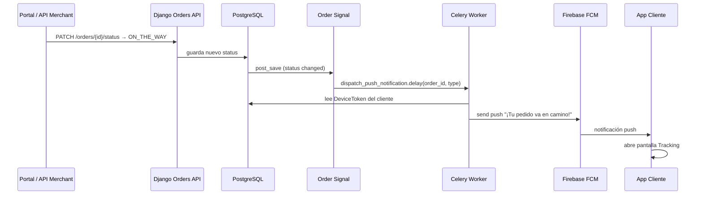

# Push Notifications — Plan de integración

**¿Puedes integrarlo ahora?** Sí, pero **en el orden correcto** del roadmap. No hace falta esperar al 100%, pero sí completar los prerequisitos de cada tarea.

## Cuándo implementar qué

```
Fase 1 (ahora)     → T1.2.8 DeviceToken + API registrar token FCM
Fase 1 (orders)    → T1.5.x OrderStatus (disparadores de push)
Fase 2             → T2.4.x Backend: Signals + Celery + FCM
Fase 4             → T4.1.5, T4.5.3–4.5.5 Cliente recibe push
Fase 4             → T4.8.2 Conductor recibe alerta nuevo pedido
```

**No rompe nada** si sigues con `T1.3.4` ahora. Las push se conectan cuando existan `Order`, `DeviceToken` y Celery (Fase 2).

---

## Flujo: comercio marca "ya salió el pedido"

Ejemplo: merchant cambia estado → `ON_THE_WAY` (o `PICKED_UP` según flujo).



---

## Mapa OrderStatus → Push

| Cambio de estado | Quién lo dispara | Destinatario | Mensaje push (ejemplo) |
|------------------|------------------|--------------|------------------------|
| `ACCEPTED_BY_MERCHANT` | Comercio | Cliente | "Tu pedido fue aceptado" |
| `IN_PREPARATION` | Comercio | Cliente | "Estamos preparando tu pedido" |
| `READY_FOR_PICKUP` | Comercio | Conductores online | "Nuevo pedido listo para recoger" |
| `DRIVER_ASSIGNED` | Sistema (Celery) | Cliente | "Conductor asignado a tu pedido" |
| `PICKED_UP` | Conductor | Cliente | "El conductor recogió tu pedido" |
| `ON_THE_WAY` | Conductor / Comercio | Cliente | "¡Tu pedido ya salió! Va en camino" |
| `DELIVERED` | Conductor | Cliente | "Pedido entregado. ¡Buen provecho!" |
| `CANCELLED` | Comercio / Sistema | Cliente | "Tu pedido fue cancelado" |

---

## Tareas del plan (IDs)

### Fase 1 — Fundamento (token FCM)

| ID | Tarea |
|----|-------|
| T1.2.8 | `DeviceToken` model + API `POST /accounts/device-token/` |

> Hacer **antes de Fase 2** bloque 2.4. Puede hacerse después de terminar bloque 1.3–1.5.

### Fase 2 — Backend push (Celery + FCM)

| ID | Tarea |
|----|-------|
| T2.4.1 | `NotificationType` enum + plantillas de mensaje |
| T2.4.2 | Cliente FCM (`firebase-admin`) con mock en tests |
| T2.4.3 | `SendPushUseCase` + task Celery `send_push_task` |
| T2.4.4 | `OrderStatusNotificationMapper` (status → tipo → destinatario) |
| T2.4.5 | Signal genérico: cambio status → encola push |
| T2.4.6 | Caso `ON_THE_WAY`: push "pedido en camino" al cliente |
| T2.4.7 | Email transaccional (Mailpit en dev) |

| ID | Tarea (signals específicos) |
|----|-------|
| T2.2.4 | Signal `READY_FOR_PICKUP` → push a conductores |
| T2.2.5 | Signal `ACCEPTED_BY_MERCHANT` → push al cliente |

### Fase 4 — Apps Flutter

| ID | Tarea |
|----|-------|
| T4.1.5 | Firebase setup app cliente (`firebase_core`, `firebase_messaging`) |
| T4.5.3 | Registrar token FCM en backend tras login |
| T4.5.4 | Handler push foreground/background/tap |
| T4.5.5 | Deep link: push `ON_THE_WAY` → `TrackingMapScreen` |
| T4.8.2 | Conductor: alerta FCM nuevo pedido (ya en plan) |

---

## Variables de entorno (producción)

```env
# backend/.env — Fase 2
FCM_CREDENTIALS_PATH=/path/to/firebase-service-account.json
# o
FCM_PROJECT_ID=tu-proyecto-firebase
```

Firebase Console → Project Settings → Service accounts → Generate key.

---

## Orden de ejecución recomendado (sin romper el plan)

1. ✅ Continuar Fase 1: `T1.3.4` → … → `T1.5.7` (orders es crítico)
2. ⏸️ Insertar `T1.2.8` antes de Fase 2 (DeviceToken)
3. Fase 2 completa incluyendo bloque 2.4 push
4. Fase 4: apps registran token y muestran push
5. Fase 5: tracking realtime complementa (mapa), push avisa el evento

---

## Qué NO hacer aún

- No configurar FCM en Flutter cliente hasta `T4.1.5` (Fase 4)
- No enviar push real hasta `T2.4.3` (mock FCM en tests hasta entonces)
- No mezclar push con WebSockets (Fase 5): push = evento; WS = ubicación en vivo
